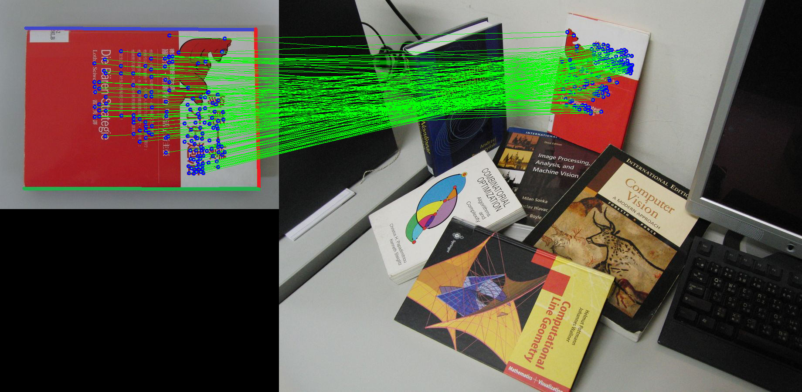

# Homograph Estimation and Correspondence

## Overview 

<p align="center">
  
</p>

This is an assignment of digital image processing and computer vision course. The problem is to find the alignment of the book images to the input image with all the books in a cluttered scene. The requirements of this assignment are (a) Establish the correspondences between the SIFT or SURF feature points between images by using the distance between the SIFT/SURF feature vectors as the matching score. Show the point correspondence results, (b) Implement the RANSAC algorithm to find the best matching homography between the template and input images. Show the detection result by showing the transformed feature set on the input image, (c) Improve the random selection of seeds by considering the matching scores computed in Problem 1 to improve the efficiency of RANSAC. Describe how to exploit the matching score in RANSAC. Compare the efficiency as well as the detection results for both versions of the RANSAC-based object detection algorithm, and (d) Implement SIFT keypoint localization and the description from scratch. Compare the result with other SIFT codes in the existing package like OpenCV.

### Contents:

- [Overview](#overview)
- [Prerequisites](#Prerequisites)
- [Folder Structure](#FolderStructure)
- [Implementation](#Implementation)

---
### Prerequisites:

- Python 3.6
- opencv 3.4.2 (important!!!!)

[[back]](#contents)
<br/>

---

### Folder Structure

>```scene/``` &nbsp; - &nbsp; images for example<br/>

>```sift.py``` &nbsp; - &nbsp; the implementation of SIFT algorithm<br/>
>```RANSAC.py``` &nbsp; - &nbsp; the implementation of RANSAC algorithm <br/>
>```utils.py``` &nbsp; - &nbsp; matching functions <br/>```main.py``` &nbsp; - &nbsp; main program for keypoint matching <br/>```analysis.py``` &nbsp; - &nbsp; analysis for the RANSAC and fastRANSAC <br/>

[[back]](#contents)
<br/>

---
### Implementation

#### (a) Matching keypoints and save the result

To finish the requirement, use the following command:

```bash
python -B main.py --img1_path "scene/book1.jpg" --img2_path "scene/scene.jpg" --method "sift" --handcraft --save_path "result/book1/sift"
```

Optional parameters (and default values):

>```--img1_path```: **```scene/book1.jpg```** &nbsp; - &nbsp; the path of object image<br/>```--img2_path```: **```scene/scene.jpg```** &nbsp; - &nbsp; the path of scene image<br/>```--method```: **```sift```** &nbsp; - &nbsp; the method to detect key points<br/>```--handcraft```: &nbsp; - &nbsp; using the handcraft sift<br/>```--save_path```: **```result/book1/sift```** &nbsp; - &nbsp; save path for the result of matching point <br/>

[[back]](#contents)
<br/>

---

#### (b) Analysis for RANSAC and the improved version

To finish the requirement, use the following command:

```bash
python -B analysis.py --img1_path "scene/book1.jpg" --img2_path "scene/scene.jpg" --method "sift" --save_path "result/book1/sift"
```

Optional parameters (and default values):

>```--img1_path```: **```scene/book1.jpg```** &nbsp; - &nbsp; the path of object image<br/>```--img2_path```: **```scene/scene.jpg```** &nbsp; - &nbsp; the path of scene image<br/>```--handcraft```: &nbsp; - &nbsp; using the handcraft sift<br/>```--save_path```: **```result/book1/sift```** &nbsp; - &nbsp; save path for the result of matching point <br/>

[[back]](#contents)
<br/>

---


